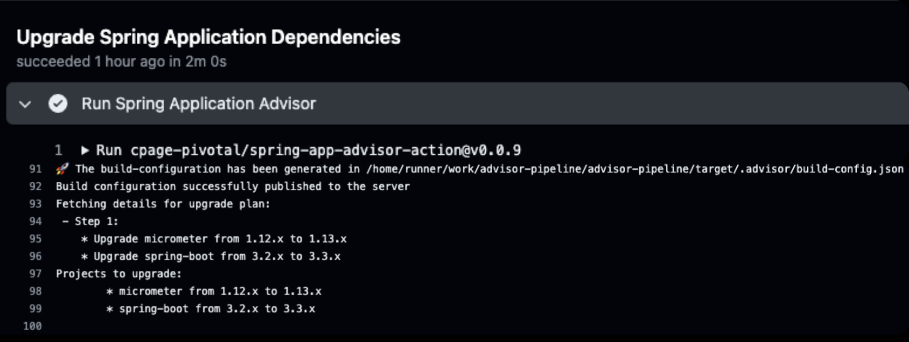
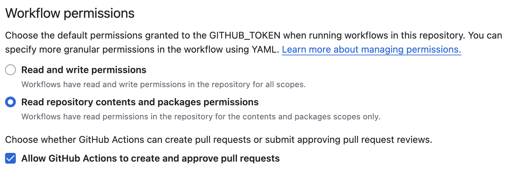

# Tanzu Deploy Action for Github Workflows

### About

Github Action to run [Spring Application Advisor](https://docs.vmware.com/en/Tanzu-Spring-Runtime/Commercial/Tanzu-Spring-Runtime/index-app-advisor.html) to upgrade your Spring application dependencies.

### Prerequisites

To use this action with your application, you must have the following:

**Spring Enterprise Maven Repository Token.** Tanzu Spring Runtime users can [follow these instructions](https://docs.vmware.com/en/Tanzu-Spring-Runtime/Commercial/Tanzu-Spring-Runtime/guide-artifact-repository-administrators.html#accessing-spring-enterprise-subscription-artifact-repositories) to generate an artifactory token for use with Application Advisor.

**Application Advisor URL.** Your Tanzu Spring Runtime administrator can provide you with a URL for your enterprise's running instance of Application Advisor. 

Your enterprise's artifact repository should be configured to host Tanzu Spring Runtime artifacts.

### Create the repository token secret

You can create your secrets at the repo or organization level for use with your Github Workflow. Here are the steps for creating at the repo level:

From your source repo, click on Settings, and select Secrets and Variables / Actions

Using the "New Repository Secret" button, generate a secret with the following name:

* **ArtifactoryToken**: The Spring Enterprise Repository token you obtained in the Prerequisites 

### Set up the Github Workflow

In the root of your source code repo, create the workflow file `.github/workflows/spring-app-advisor.yaml`. Copy the contents of the [Sample Workflow](sample-workflow.yaml) into this file.

Replace the fields marked `<<ENTER VALUE>>` with your own values:
* `app_advisor_server:` The Application Advisor URL you obtained in the Prerequisites (e.g. `http://app-advisor.my-company.com:9000`)

**IMPORTANT:** Be sure that your Github Workflow has permissions to generate pull requests against your repo. From your source repo, click on Settings, and select Actions / General. Scroll down, and ensure the checkbox pictured at the bottom is checked:

### Run the workflow

Commit your changes to Github. This will trigger a run of the workflow. You can track progress of the workflow under the Actions tab of your repo.

